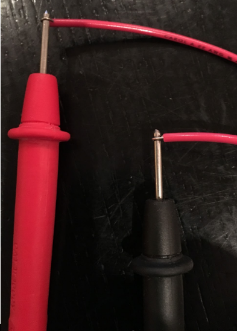
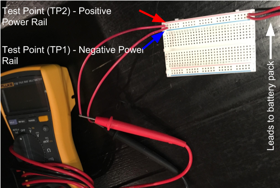
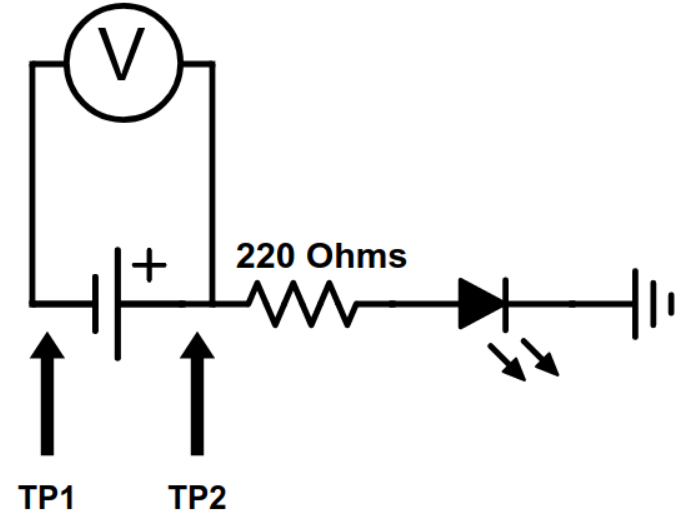
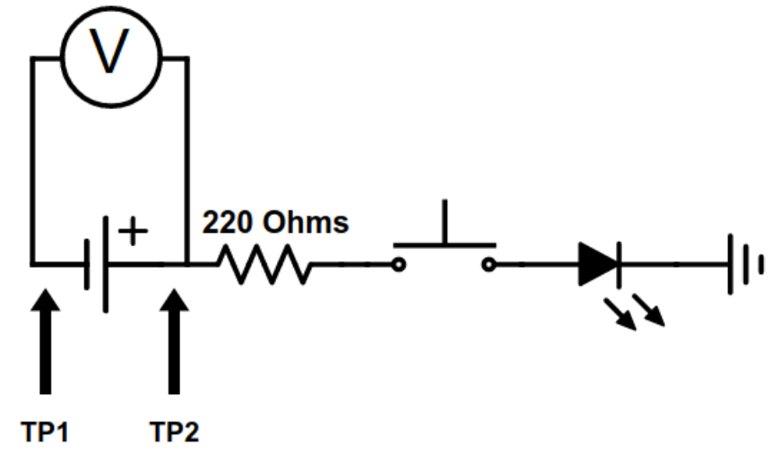
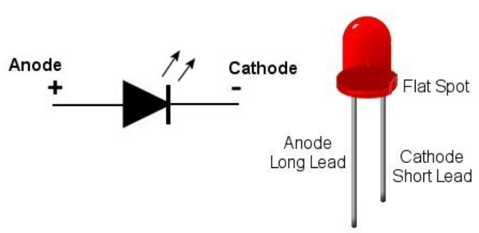

# Electronic Skills 1: Single LED
In this assignment you learn how to use a breadboard for creating a simple circuit with a single LED.

## Instructions
Read all of the instructions before starting the assignment.
1. Start by watching the following videos 
  * Introduction to breadboards: https://youtu.be/oiqNaSPTI7w 
  * Introduction to LEDs: https://youtu.be/GbyxKEXU5iQ  
  * Introduction to resistors: https://youtu.be/D04p1FjgtIE  
2. Get the following materials:
  * A breadboard (from your teacher)
  * A LEDs
  * A 330 Ohm resistor
  * Hookup wire
  * Small ziplock bag - for storing your electronic components  
3. For this assignment you will also need a DMM and a functional battery pack or power supply.
4. Label your breadboard with your name using a piece of masking tape (do NOT write directly on the breadboard and do NOT peel off the sticky backing on the breadboard).
5. Using a DMM test your battery pack, resistor and LED. 
6. Prepare your DMM by attaching leads to the probes (See picture).

7. Set up your breadboard with your battery pack and DMM  connected to the power rails. The location in the circuit where the DMM is connected is called a Test Point (TP). This way you are able to verify that the power rails have power. When building a circuit you always need to have the breadboard setup this way.

## Circuit 1.1
Using the following video instructions (https://youtu.be/PBICRVtg884, up to the 3:50 mark) and the following circuit diagram breadboard an LED circuit the way it is shown in the video. Do NOT use hot glue to attach the the leads to the power rail the way they do it in the video. Make sure your DMM remains connected to the Test Point (TP) (this is not included in the video).

Show your circuit to your teacher for marking.

## Circuit 1.2
Modify your circuits to include a push button. 

Show your circuit to your teacher for marking.

## Supplementary Material
### Terminology
Polarity, polarized components, cathode and anode: https://learn.sparkfun.com/tutorials/polarity/diode-and-led-polarity 

### Best Practices for Breadboarding
* Power supply is connected to the power rails on the breadboard and nowhere else on the breadboard
* Use hook up wires to carry power from the power rails into the center of the breadboard.
* One hole = one connection.
* Electronic components and wiring is neatly and logically organized (No “rat’s nest”)
* Hookup wires are only as long as need be and no longer and lay flat against the breadboard.
* Choose the shortest wire corresponding to the distance to be traveled.
* Try to keep wires straight (along vertical/horizontal lines) and as close to the breadboard as possible.
* No/minimize crossing wires
* No exposed stripped ends on hookup wires
* Unplug the breadboard when rearranging the wires. Only connect the power supply when you have a complete circuit.
* Arrange the components to minimize the length of wires needed.

### LED Pinout

